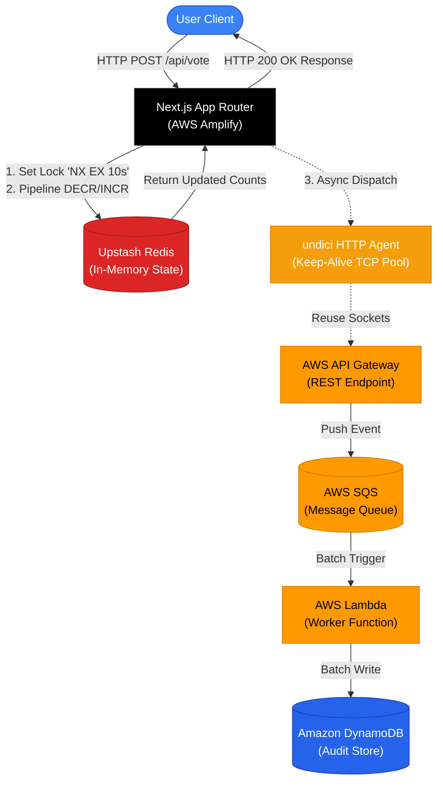

# ⚡ FamVote — Distributed High-Concurrency Live Voting Platform

[](https://famvote.adrianfdz.com)
[](https://nextjs.org/)
[](https://www.terraform.io/)
[](https://www.artillery.io/)
[](https://upstash.com/)

An event-driven, production-grade voting platform architected to handle high-concurrency traffic with sub-10ms response times. Engineered using an asynchronous, decoupled pipeline to offload heavy persistence tasks from the critical HTTP request path while ensuring strict atomic rate limiting.

🔗 **Live Application:** [famvote.adrianfdz.com](https://famvote.adrianfdz.com)  
👤 **Author:** Adrian Fernandez — [Portfolio](https://adrianfdz.com) | [LinkedIn](https://www.linkedin.com/in/francisco-adrian-ruiz-fernandez-38370b274)

---

## 📐 System Architecture

The core engineering objective of **FamVote** is to guarantee extreme responsiveness and throughput under heavy concurrent write loads. Instead of writing directly to a transactional SQL database on every user vote, the application utilizes a **two-tier asynchronous pipeline**:



```markdown
### Component Specifications

| Component | Infrastructure Layer | Primary Responsibility | Key Configuration / Mechanics |
| :--- | :--- | :--- | :--- |
| **User Client** | AWS Amplify Edge | Serves the frontend closest to the user. | Edge-cached static assets, HTTP POST requests. |
| **App Router** | Next.js Engine | Handles incoming traffic and orchestrates memory pipelines. | Non-blocking execution, high-concurrency routing. |
| **In-Memory Cache** | Upstash Redis | Manages volatile state, vote limits, and instant counters. | Multi-command atomic pipelining. |
| **HTTP Client** | undici Agent | Dispatches events off-thread to the cloud infrastructure. | Layer 4 Keep-Alive pool with **200 persistent sockets**. |
| **Ingress Gate** | AWS API Gateway | Proxies HTTP payloads into AWS internal infrastructure. | Low-latency managed endpoint routing. |
| **Message Broker** | AWS SQS | Buffers incoming execution payloads to protect downstream databases. | Persistent message queueing, decoupling fast/slow paths. |
| **Compute Worker**| AWS Lambda | Consumes queue batches and executes business logic. | Event-driven on-demand scaling. |
| **Database** | Amazon DynamoDB | Final source of truth for long-term historical records. | Multi-region durable audit logs. |

### Execution Pipeline

#### 1. The Fast Path (Synchronous In-Memory)
When a user submits a vote, the system processes it atomically in memory to ensure sub-millisecond response times:
1. **Atomic Lock**: A Redis `SET NX EX` lock is acquired to prevent double-voting or race conditions.
2. **Balance Check**: The user's daily vote balance is decremented safely via `DECR`.
3. **Counter Update**: The target candidate's real-time vote count is updated via `INCR`.

#### 2. Asynchronous Dispatch & Background Processing
Once the memory state is updated, the transaction is offloaded downstream without blocking the user:
1. **Connection Pooling**: The Next.js layer utilizes an optimized **undici** HTTP agent with 200 keep-alive sockets to push events to AWS API Gateway.
2. **Queueing**: API Gateway routes the payload instantly into an **AWS SQS Queue**, offloading the request from the web runtime.
3. **Persistence**: An **AWS Lambda** worker triggers automatically, ingesting the SQS messages to perform heavy write operations and write the immutable audit trail into **Amazon DynamoDB**.
```

### Key Architectural Patterns
1. **At-Most-Once / Atomic Lock Guarantee:** Utilizes Redis `SET key value EX 10 NX` locks combined with transactional pipelines (`decr` / `incrby`) to guarantee strict cooldowns and zero race conditions under concurrent requests.
2. **Asynchronous Decoupling via SQS:** Complete separation of critical user feedback loops from audit-log database writes. The HTTP handler returns instantly after the Redis pipeline succeeds, forwarding events to AWS SQS via AWS API Gateway in the background.
3. **Infrastructure as Code (IaC):** AWS API Gateway, SQS, Lambda workers, and DynamoDB tables are entirely provisioned and managed via **Terraform**.

---

## 🔬 Benchmark & Stress Test Results

The platform was subjected to sustained high-concurrency load testing using **Artillery**, targeting real-world cloud endpoints with authenticated JWT sessions.

### Performance Summary

| Metric | Target / Result |
| :--- | :--- |
| **Total Requests Processed** | `7,250` requests |
| **Peak Throughput** | `200` Requests Per Second (RPS) |
| **Success Rate** | **`100.0%`** (`0` failed VUsers / `0` socket errors) |
| **Median Response Time ($p_{50}$)** | **`4.0 ms`** (Local Engine) / **`333.7 ms`** (End-to-End Cloud RTT) |
| **95th Percentile ($p_{95}$)** | **`8.9 ms`** (Local Engine) / **`354.3 ms`** (End-to-End Cloud RTT) |
| **99th Percentile ($p_{99}$)** | **`18.0 ms`** (Local Engine) / **`376.2 ms`** (End-to-End Cloud RTT) |

### Key Benchmark Insights & Bottleneck Resolution
* **Socket Exhaustion (Layer 4 TCP Bottleneck):** During initial 200 RPS ramp-up tests, ~15% of outgoing requests failed with `ERR_SOCKET_TIMEOUT` due to ephemeral port exhaustion from opening and closing HTTPS connections to AWS API Gateway per request.
* **The Solution:** Implemented a persistent connection-pooling HTTP Agent via `undici` with a Keep-Alive configuration (`connections: 200`). Reusing open TCP sockets and TLS sessions eliminated socket bottlenecks, achieving a **100% success rate across all 7,250 requests**.

---

## 🛠 Tech Stack & Tools

* **Frontend & Server Engine:** Next.js 15 (App Router, React 19, Tailwind CSS)
* **Authentication:** Stateless JWT verification via `jose`
* **In-Memory Cache & Rate Limiter:** Upstash Redis (Serverless) / Docker Local Redis
* **Asynchronous Messaging & Queue:** AWS API Gateway $\rightarrow$ AWS SQS
* **Serverless Compute:** AWS Lambda (Node.js 20 runtime)
* **NoSQL Database:** Amazon DynamoDB
* **Infrastructure as Code:** HashiCorp Terraform
* **Testing & Quality Assurance:** Vitest (Unit/Integration) & Artillery (Load Testing)

---

## 🚦 Getting Started Locally

### Prerequisites
Before running the application, ensure you have the following installed and configured:
* **Node.js** v20 or higher
* **Docker Desktop** (required for local Redis & DynamoDB emulation)
* **AWS CLI** configured with valid infrastructure credentials

### Installation & Setup

1. **Clone the Repository**
   ```bash
   git clone https://github.com
   cd famvote
   ```

2. **Configure Environment Variables**
   Create a `.env.local` file inside the `client` directory using the following reference table:

| Variable Name | Required Value / Format | Description |
| :--- | :--- | :--- |
| `JWT_SECRET` | `your-jwt-secret-key` | Secret key used to sign and verify user session tokens. |
| `UPSTASH_REDIS_REST_URL` | `https://your-redis-endpoint.upstash.io` | REST endpoint for the Upstash Redis instance. |
| `UPSTASH_REDIS_REST_TOKEN` | `your-upstash-token` | Authentication token for the Upstash Redis REST API. |
| `NEXT_PUBLIC_API_GATEWAY_VOTE_URL` | `https://your-api-gateway.amazonaws.com/prod/vote` | Public AWS API Gateway endpoint for asynchronous dispatch. |

3. **Install Dependencies**
   ```bash
   npm install
   ```

4. **Run the Development Server**
   ```bash
   npm run dev
   ```
   Open [http://localhost:3000](http://localhost:3000) with your browser to see the result.

---

## 🧪 Testing Suite

### Unit & Integration Testing (Vitest)
Execute the core test suite to validate API routes, authentication handlers, and core state changes:
```bash
npm run test
```

### High-Concurrency Stress Testing (Artillery)
To reproduce the **200 RPS benchmark** against your local environment or production target, execute the following performance pipeline:

1. **Spin up production build locally**
   ```bash
   npm run build && npm run start
   ```

2. **Execute the Artillery load test scenario**
   ```bash
   npx artillery run --output report.json ./artillery/config.yml
   ```

3. **Parse and analyze execution metrics**
   ```bash
   jq '.aggregate.counters' ./artillery/report.json
   ```

---

## 📜 License
Distributed under the **MIT License**. See the `LICENSE` file for more information.
